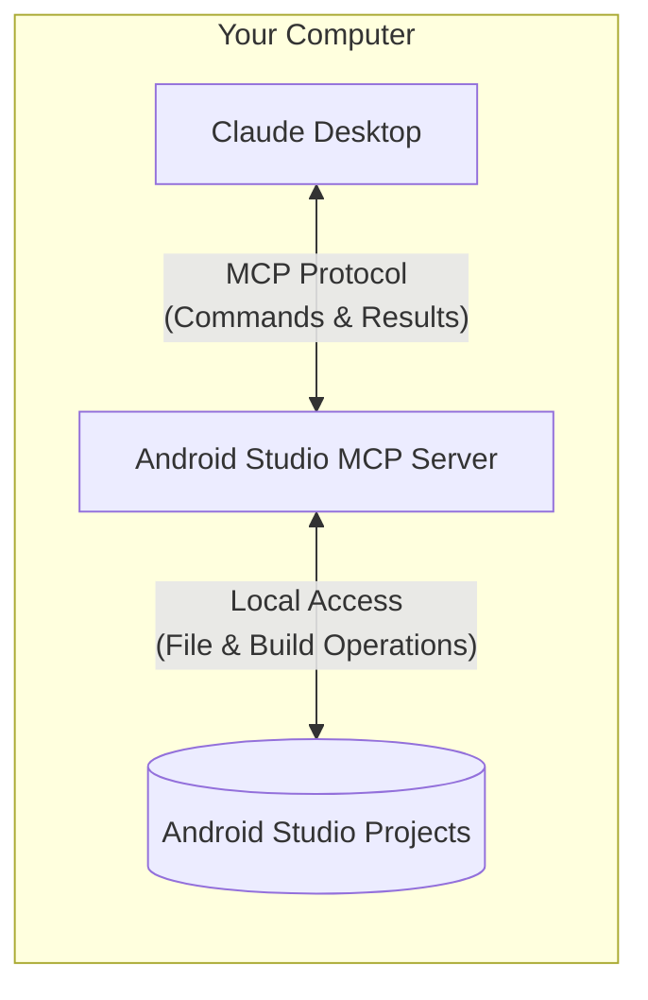

# Android Studio MCP Server

> **⚠️ DEVELOPMENT STATUS**: This project is currently in early development and is not yet functional. The implementation is a placeholder with minimal functionality. Features, APIs, and documentation may change significantly.

A Model Context Protocol (MCP) server that provides programmatic control over Android Studio. This server acts as a bridge between Claude and your local Android Studio development environment, enabling intelligent code assistance, project management, and automated development tasks.

## What is Android Studio MCP Server?

This server follows a client-server architecture where Claude can securely interact with your local Android Studio projects:

The communication between the Android Studio MCP server and your local projects happens entirely on your machine—your code is not exposed to the internet. The Model Context Protocol ensures that Claude can only perform approved operations through well-defined interfaces, giving you a secure way to let AI assist with your development while maintaining complete control.

## Features (Planned)

### 🔍 Intelligent Project Detection
- Automatically find and connect to your active Android Studio project
- Support manual project selection for precise control
- Maintain workspace context across interactions

### 📁 Smart File Operations
- Read and analyze Java, Kotlin, XML, and project configuration files
- Create and modify source files with proper syntax and imports
- Intelligent file listing with type filtering and search

### 🛠 Project Management
- Access project modules, build variants, and configurations
- Analyze source files for potential issues
- Execute builds with specific configurations
- Run and manage test suites

### 📱 Android-Specific Features
- Interact with Android emulators
- Manage dependencies in Gradle files
- Access layout previews
- Resource management (strings, drawables, etc.)

## Prerequisites

- Node.js 18.x or later
- Android Studio installation
- Java Development Kit (JDK)
- Android SDK
- Claude Desktop with MCP support

## Technical Implementation

This project is implemented in TypeScript, leveraging the following technologies:

- TypeScript for type-safe code
- Node.js for cross-platform compatibility
- Model Context Protocol (MCP) SDK for Claude integration
- Gradle integration for Android project management

## Installation

This is a placeholder repository. Installation instructions will be provided once implementation begins.

### Basic Setup (Once Implemented)

1. Clone the repository
2. Install dependencies with `npm install`
3. Build the project with `npm run build`
4. Create a `config.yml` file based on the example
5. Run the server with `npm start`

## Usage

The server will provide a natural interface for Claude to assist with your Android Studio development. Here are some example interactions that will be supported:

### Project Navigation
- "Set my Android Studio projects directory to `/Users/username/AndroidStudioProjects`"
- "What's my current active project?"
- "Switch to the MyAndroidApp project"
- "Show me all Kotlin files in the project"

### Code Creation & Modification
- "Create a new Activity called ProfileActivity"
- "Add a LiveData property to UserViewModel.kt"
- "Set up a modern coroutine-based networking layer"
- "Implement Room database with Kotlin flows"

### Project Analysis & Building
- "Analyze NetworkManager.kt for potential issues"
- "Build the project in debug configuration"
- "Run the unit tests for the UserRepository module"
- "What build variants are available?"

## Contributing

This is a placeholder repository. Contribution guidelines will be provided once implementation begins.

## License

This project is licensed under the MIT License - see the [LICENSE](LICENSE) file for details.

## Acknowledgments

- Built with [Model Context Protocol (MCP)](https://modelcontextprotocol.io/introduction)
- Inspired by [android-mcp-server](https://github.com/minhalvp/android-mcp-server) and [xcode-mcp-server](https://github.com/Anthropic-Labs/xcode-mcp-server) 